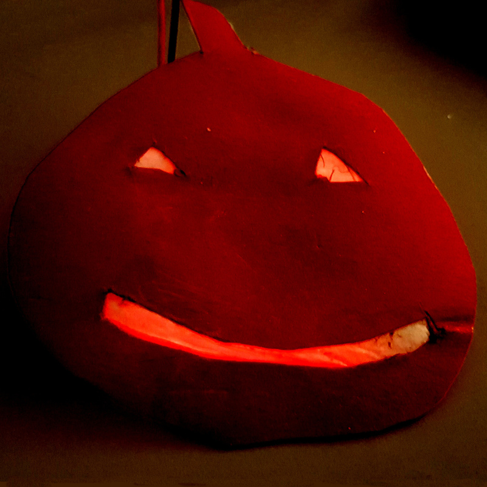

# beleuchteter Kürbis

## Material:

+ mirco:bit
+ Tonpapier
+ Pergamentpapier
+ Kleber

<!-- Anleitung erstellen -->

## Editor:

[https://makecode.microbit.org/](https://makecode.microbit.org/)

## Funktion:

## Programmbeispiel
[microbit-pumpkin.hex](appendix/microbit-pumpkin.hex)
