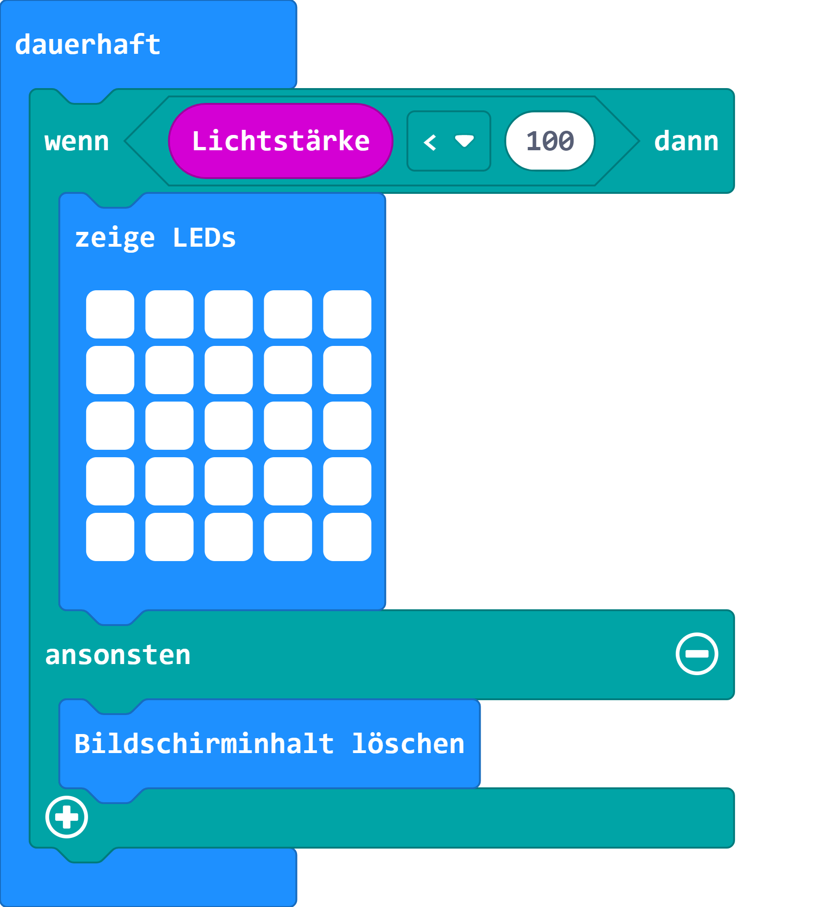
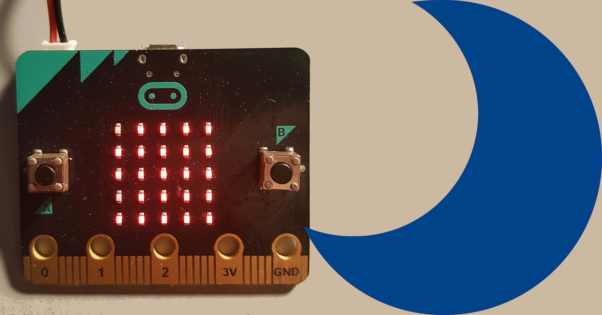

# Nachtlicht

## Material:

+ mirco:bit

## Editor:

[https://makecode.microbit.org/](https://makecode.microbit.org/)

## Funktion:

1. Wie das Sonnenlicht_Sensor-Projekt, nutzt dieses Projekt die micro:bit’s LEDs als einen Licht-Sensor Eingang.
2. Es nutzt die Auswahl wenn der Wert für den micro:bit unter ein bestimmtes Level fällt (<) 100. Wenn es Dunkel ist, leuchten die LEDs des micro:bit, sonst wird der Bildschirm geleert und die LEDs bleiben dunkel.
3. Eventuell musst du den Wert von 100 anpassen, abhängig der Lichtwerte deiner Umgebung.
4. Was denkst du für was könnte man ein Nachtlicht benötigen?
   Kann es die Sicherheit von Personen oder Tiere im Dunkeln verbessern?

## Programmbeispiel
[microbit-nachtlicht.hex](appendix/microbit-nachtlicht.hex)
