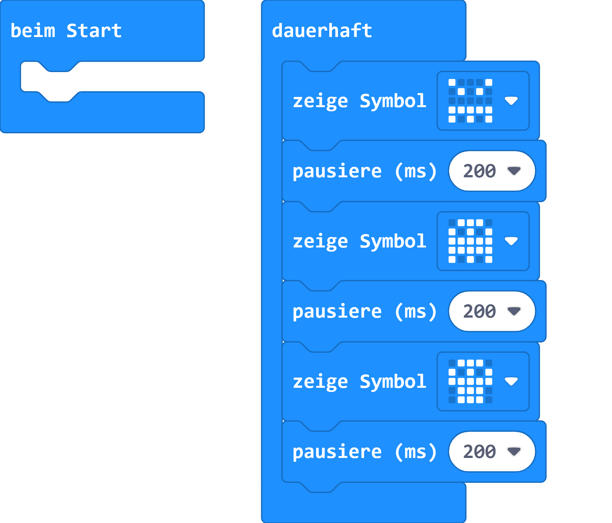

# Gruselige Gesichter

Die kannst mithilfe der integrierten Symbole des micro:bit ein gruseliges Gesicht oder Bilder hinzufügen.

## Material

+ mirco:bit

## Editor

[https://makecode.microbit.org/](https://makecode.microbit.org/)

## Funktion

<iframe src="https://player.vimeo.com/video/471694496" width="640" height="1138" frameborder="0" allow="autoplay; fullscreen" allowfullscreen></iframe>

## Programmbeispiel
[microbit-gruselige-gesichter.hex](appendix/microbit-gruselige-gesichter.hex)
