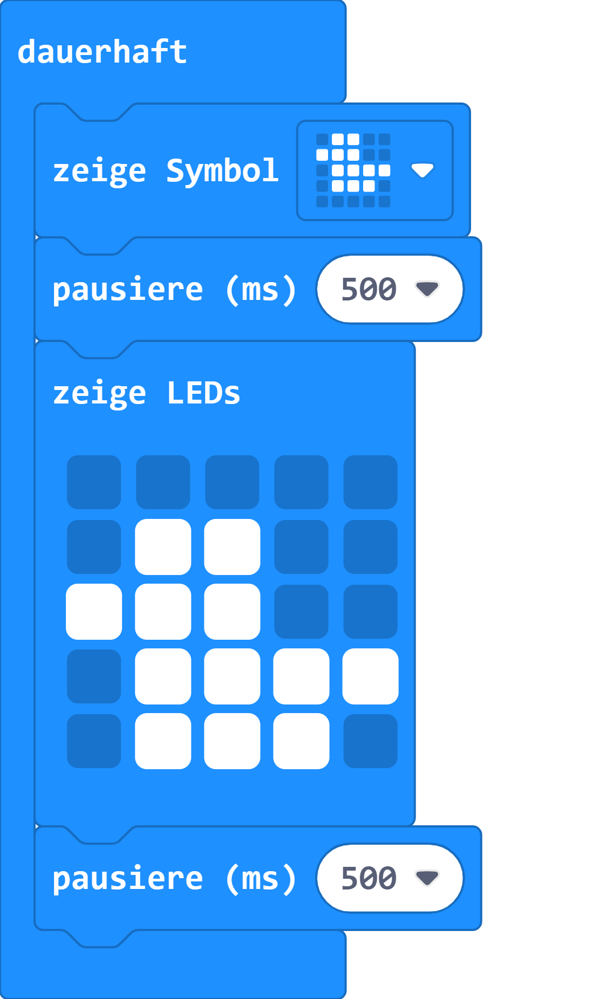

# animierte Tiere

## Material:

+ mirco:bit

## Editor:

[https://makecode.microbit.org/](https://makecode.microbit.org/)

## Funktion:

<iframe src="https://player.vimeo.com/video/471694646" width="640" height="1138" frameborder="0" allow="autoplay; fullscreen" allowfullscreen></iframe>

## Programmbeispiel
[microbit-animated-animals.hex](appendix/microbit-animated-animals.hex)
