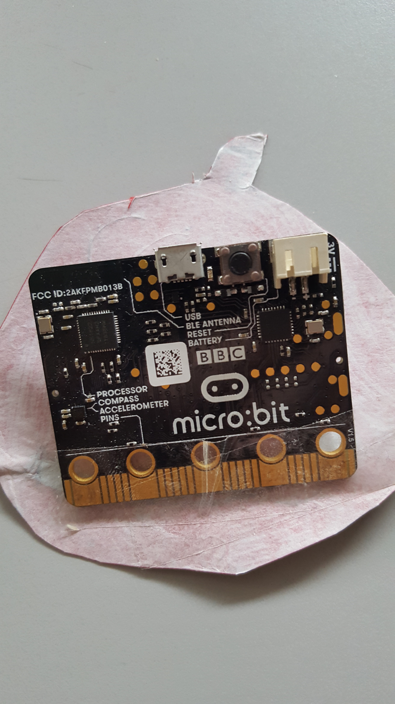
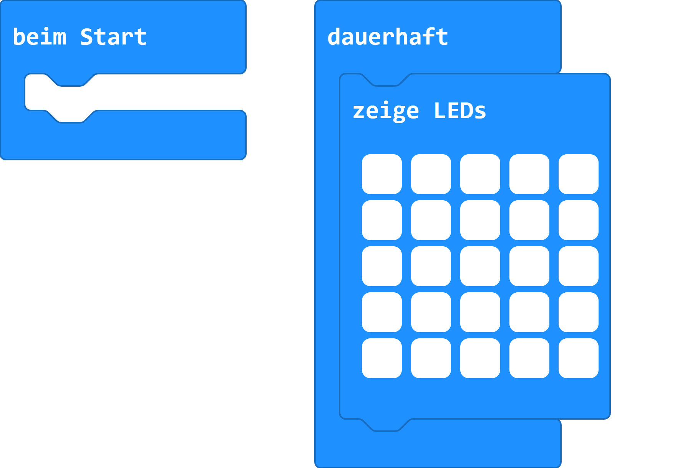

# beleuchteter Kürbis

## Material:

+ mirco:bit
+ Tonpapier
+ Pergamentpapier
+ Kleber

#### Vorlage

[Pumpkin-Jack-o-Lantern-face2.svg](images/Pumpkin-Jack-o-Lantern-face2.svg)

1. Die Vorlage auf einen Bogen Tonpapier zeichnen
2. Die Größe so wählen, das der micro:bit gerade so rein passt. Nicht zu groß zeichnen.
3.  Die Rückseite mit einem Bogen Pergamentpapier bekleben.
4. Kleber gut trocken lassen.
5. Den micro:bit auf der Rückseite mit et was Klebestreifen befestigen.
6. Das Programm übertragen.
7. Programmstarten und der Kürbis leuchtet jetzt.

## Editor:

[https://makecode.microbit.org/](https://makecode.microbit.org/)

## Funktion:

### Vorderseite

### Rückseite

## Programmbeispiel
[microbit-pumpkin.hex](appendix/microbit-pumpkin.hex)
