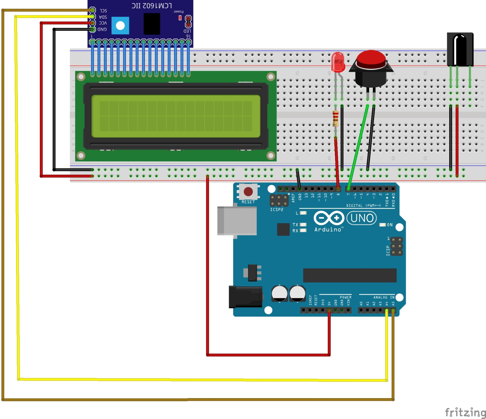

# Projektname: PfaDJ        

## Kurzbeschreibung:

Der PfaDJ wählt per Zufall ein Lied für die Singerunde aus. Der Titel
des Liedes und Seitenangabe im Liederheft werden auf einem LCD-Display
angezeigt.

Durch Drücken des Buzzers wird der Zufallsgenerator gestartet. Wird der
Buzzer länger gedrückt wird läuft die Zufallsausgabe länger. Alternativ
kann der Zufallsausgabe auch per Infrarot-Fernbedienung ausgelöst
werden.

## Zielgruppe

Pfadfinder*innen // Ranger/Rover

## Materialbedarf

* Buzzer
* LCD Display
* Arduino
* Kabel
* Mini-Seitenschneider
* Adapter 9V-Blockbatterie → mobile Anwendung / alternativ & besser Batteriepack

### Erweiterung:
* Mit Fernbedienung
* Infrarot-Empfänger
* Fernbedienung

## Arbeitsschritte:

Erfassung Lieder/Seite über Excel → Export als CSV-Datei.\
Aufbau Lieder-Datei (Excel): Titel;Seite

**Problem / Hinweis:**

Excel-Tabelle → Export CSV: Trennzeichen „|, keine Zeichen um die Texte!

Zeichenformat: Unicode\
Danach alles in eine Zeile → Tool: Editor  Strg + J\

**Programmierung:**

Problem: Zufallsfunktion →Anzahl Lieder muss ermittelt
werden → gerade wird das händisch eingegeben

Sonderzeichen Workaround für die Sonderzeichen (eigene Zeichen gezeichnet)

