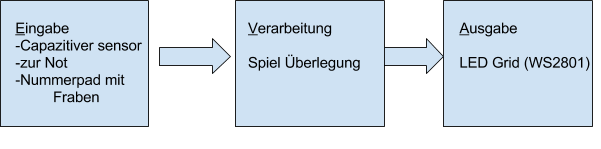

# Projektname: Twister Pong

## Kurzbeschreibung:

TwisterPong ist ein Projekt das mit einer Gruppe von bis zu 8 Personen
(bei einem Gruppenleiter) über mehrere Gruppenstunden/Einheiten
durchgeführt wird. Es wird ein interaktives Spiel kreiert, dass auf dem
Computerspiel PingPong basiert. Dieses Spiel kann auch jeder Zeit
kreativ abgewandelt werden. Ziel ist es, dass sich alle TN, auch ohne
Vorkenntnisse aktiv einbringen können.

Da das Spiel erfordert einen Gruppenleiter, der über ausreichend große
technische Kenntnisse verfügt.

## Zielgruppe

Pfadfinder*rinnen

## Materialbedarf

-Alufolie
-Kabel
-Pappe
-Klebeband
-25MOhm Wiederstände
-vielleicht 100 pF kondestoren
-WS2801 Lichterkette (18€ bei Ebay)
-Arduirno Mega

### Räumlichkeiten
Ausreichend großer Gruppenraum, ist aber auch im Außenbereich möglich.

## Arbeitsschritte:

### Gruppenstunde 1

-       TN mit dem Material vertraut machen. Kabel, Lampen, Schalter
verbinden.
-       Stromkreise bauen.
-       Mit Hilfe der Beispiele in der Aduino Software bspw. Lämpchen
zum blinken bringen.
-       Schalter einbauen usw.

### Gruppenstunde 2: {#h.8u6ckkcuvba4 .c14}
-       Spielidee spinnen, entwickeln.
-       Arbeitsschritte klären
-       Vorkenntnisse klären, Ideen einbringen, Aufgaben aufteilen.

### Gruppenstunde 3: {#h.s2e7qv4aj5pw .c14}
-       erste Arbeitsschritte ausprobieren.

AG 1: Fläche (2 Personen)
AG 2: Gitter
-       LED´s
AG 3: Programmieren
1.     Phase
Grobe Planung (Spielidee, verfügbares Material, Vorkenntnisse ...)
2.     Phase
Ausprobieren/ Testphase
-       Barfuß oder mit Schuhe?
-       Folie testen
-       LED´s testen

### TwisterPong

Zielgruppe: 14 – 16
Gruppengröße ca. 8 Personen
Gruppenstunde ca. 1,5 Stunden oder Samstag 9:00 – 15:00 Uhr.

(Variante 1: Teilnehmer mit Vorkenntnissen)

Variante 2: Teilnehmer ohne Vorkenntnisse (bzw. mit grundlegenden
technischen Kenntnissen)

Kurzbeschreibung

TwisterPong ist ein Projekt das mit einer Gruppe von bis zu 8 Personen
(bei einem Gruppenleiter) über mehrere Gruppenstunden/Einheiten
durchgeführt wird. Es wird ein interaktives Spiel kreiert, dass auf dem
Computerspiel PingPong basiert. Dieses Spiel kann auch jeder Zeit
kreativ abgewandelt werden. Ziel ist es, dass sich alle TN, auch ohne
Vorkenntnisse aktiv einbringen können.

Da das Spiel erfordert einen Gruppenleiter, der über ausreichend große
technische Kenntnisse verfügt.

Wichtig ist, dass vor Beginn des großen Projekts den TN ausreichend Zeit
zum ausprobieren gegeben wird.

 

Räumlichkeiten
Ausreichend großer Gruppenraum, ist aber auch im Außenbereich möglich.

Material:
Laptop mit Arduino Software (zum kostenlosen Download im Internet)
Arduino
Scoutlab -  Box
