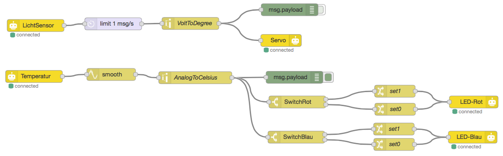
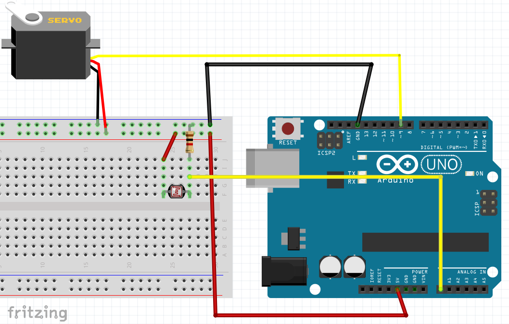
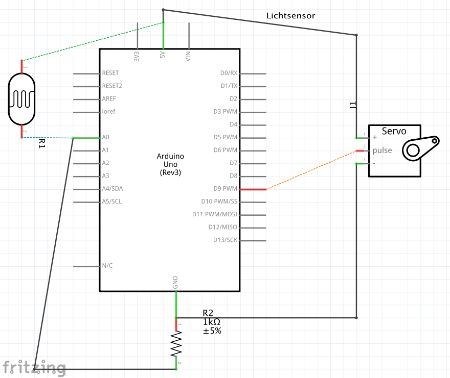

# Projektname: Wetterstation

## Kurzbeschreibung:

Aufbau einer modularen Wetterstation, die je nach Zeit und Zweck verschiedene Umweltdaten aufnimmt, auswertet und für die Gruppe aufbereitet.

## Zielgruppe

Pfadfinder*innen // Ranger/Rover

## Materialbedarf

Grundmaterial:

-   RaspberryPi
-   Material für Gehäuse
-   Schutzhülle für Sensoren
-   Verbindungen
-   Sensoren

Für Hinweis Drehrad:

-   Servo-Motor
-   Eisstiele
-   buntes Papier & Kleber

Hinweise

-   Drehrad (Barometer)
-   LED Indicator
-   Transparente Papier
-   Cocktailschirm
-   LED Helligkeit

Inputs:

-   Bewölkung
-   Luftfeuchtigkeit
-   Kamera
-   Wind/Richtung, Geschwindigkeit
-   Temperatur
-   Sonnenstunden
-   Regenmenge
-   Luftdruck

Outputs:

-   Hinweise
-   Regenschirm/ Sonnenschrim/ Kopfbedeckung
-   Innenlichtkontrolle
-   Aktuelle Messwerte Anzeigen
-   Regelmäßige Zusammenfassung
-   Wetteraufzeichnung (Graph, Kurve, …)
-   Live-Webcam für Eltern

## Arbeitsschritte:

Hinweisrad (Regen/Bewölkt/Sonne)

evtl. LED Display

Temperatur

Lichtsensor

Luftfeuchte

### Programmierung mit Node-Red über Firmata



Block

Beschreibung

Eingabe/Ausgabe

LichtSensor (GPIO)

AnalogPin 0

Ausgabe: Wert zwischen 0 (dunkel) und 1024 (hell)

limit 1 msg/s (Delay)

Gibt nur einen Wert pro Sekunde weiter, löscht den Rest (drop
intermediate messages)

Eingabe = Ausgabe

VoltToDegree (Range)

Übersetzt den Eingabewert (0-1024) in die entsprechende Position des
Motors (0°-180°)

Eingabe (0-1024)

Ausgabe (0-180)

msg.payload (Debug)

Zeigt die empfangene Nachricht im Debug-Fenster von Node-Red an

Ausgabe: Text im Browser

Servo (GPIO)

Type: Servo, Pin 9

Gibt dem Stellmotor eine bestimmte Gradzahl

Eingabe: Grad des angeschlossenen Stellmotors

### Schaltbild Lichtsensor

### 

### Node-Red Code

```
[{"id":"99b505cf.664af8","type":"nodebot","z":"f32cc1f5.0cd34","name":"Arduino
Uno","username":"","password":"","boardType":"firmata","serialportName":"/dev/cu.usbmodemfa131","connectionType":"local","mqttServer":"","socketServer":"","pubTopic":"","subTopic":"","tcpHost":"","tcpPort":"","sparkId":"","sparkToken":"","beanId":"","impId":"","meshbluServer":"https://meshblu.octoblu.com","uuid":"","token":"","sendUuid":""},{"id":"78634b5f.879cb4","type":"gpio
in","z":"f32cc1f5.0cd34","name":"LichtSensor","state":"ANALOG","samplingInterval":"1000","pin":"0","board":"99b505cf.664af8","x":146.5,"y":93,"wires":[["5ace04e6.a531fc"]]},{"id":"2d5ae05.fd2a52","type":"debug","z":"f32cc1f5.0cd34","name":"","active":false,"console":"false","complete":"payload","x":771.5,"y":54,"wires":[]},{"id":"86bf7105.79409","type":"range","z":"f32cc1f5.0cd34","minin":"450","maxin":"900","minout":"180","maxout":"30","action":"clamp","round":true,"name":"VoltToDegree","x":527.5,"y":88,"wires":[["d07f65f4.2f8098","2d5ae05.fd2a52"]]},{"id":"d07f65f4.2f8098","type":"gpio
out","z":"f32cc1f5.0cd34","name":"Servo","state":"SERVO","pin":"9","i2cDelay":"0","i2cAddress":"","i2cRegister":"","outputs":0,"board":"99b505cf.664af8","x":750.5,"y":130,"wires":[]},{"id":"95ee15a8.6a11e8","type":"gpio
in","z":"f32cc1f5.0cd34","name":"Temperatur","state":"ANALOG","samplingInterval":"100","pin":"1","board":"99b505cf.664af8","x":142.5,"y":219,"wires":[["db8ff0bf.24701"]]},{"id":"db8ff0bf.24701","type":"smooth","z":"f32cc1f5.0cd34","name":"","action":"mean","count":"100","round":"","x":332.5,"y":214,"wires":[["f442dd5a.0bbd2"]]},{"id":"9237271f.6dc8d8","type":"debug","z":"f32cc1f5.0cd34","name":"","active":true,"console":"false","complete":"false","x":783.5,"y":221,"wires":[]},{"id":"5ace04e6.a531fc","type":"delay","z":"f32cc1f5.0cd34","name":"","pauseType":"rate","timeout":"5","timeoutUnits":"seconds","rate":"1","rateUnits":"second","randomFirst":"1","randomLast":"5","randomUnits":"seconds","drop":true,"x":337.5,"y":89,"wires":[["86bf7105.79409"]]},{"id":"f442dd5a.0bbd2","type":"range","z":"f32cc1f5.0cd34","minin":"0","maxin":"1024","minout":"0","maxout":"400","action":"scale","round":false,"name":"AnalogToCelsius","x":539.5,"y":222,"wires":[["9237271f.6dc8d8","1b0bdd68.e4f423","d2df0383.2d21"]]},{"id":"7b20cd0b.84df34","type":"gpio
out","z":"f32cc1f5.0cd34","name":"LED-Blau","state":"OUTPUT","pin":"2","i2cDelay":"0","i2cAddress":"","i2cRegister":"","outputs":0,"board":"99b505cf.664af8","x":1222.166618347168,"y":369.0000352859497,"wires":[]},{"id":"23b443ce.dc4bbc","type":"change","z":"f32cc1f5.0cd34","name":"set0","rules":[{"t":"set","p":"payload","pt":"msg","to":"0","tot":"num"}],"action":"","property":"","from":"","to":"","reg":false,"x":1028.666618347168,"y":387.0000352859497,"wires":[["7b20cd0b.84df34"]]},{"id":"be2b3030.41d4d","type":"change","z":"f32cc1f5.0cd34","name":"set1","rules":[{"t":"set","p":"payload","pt":"msg","to":"1","tot":"num"}],"action":"","property":"","from":"","to":"","reg":false,"x":1028.166618347168,"y":349.0000352859497,"wires":[["7b20cd0b.84df34"]]},{"id":"d2df0383.2d21","type":"switch","z":"f32cc1f5.0cd34","name":"SwitchBlau","property":"payload","propertyType":"msg","rules":[{"t":"lte","v":"25","vt":"num"},{"t":"gt","v":"25","vt":"num"}],"checkall":"true","outputs":2,"x":788.166618347168,"y":369.0000352859497,"wires":[["be2b3030.41d4d"],["23b443ce.dc4bbc"]]},{"id":"80184b1f.7fe7b8","type":"gpio
out","z":"f32cc1f5.0cd34","name":"LED-Rot","state":"OUTPUT","pin":"4","i2cDelay":"0","i2cAddress":"","i2cRegister":"","outputs":0,"board":"99b505cf.664af8","x":1224.666618347168,"y":282.0000352859497,"wires":[]},{"id":"47cc4377.b833bc","type":"change","z":"f32cc1f5.0cd34","name":"set0","rules":[{"t":"set","p":"payload","pt":"msg","to":"0","tot":"num"}],"action":"","property":"","from":"","to":"","reg":false,"x":1031.166618347168,"y":300.0000352859497,"wires":[["80184b1f.7fe7b8"]]},{"id":"87f04ea2.780fb","type":"change","z":"f32cc1f5.0cd34","name":"set1","rules":[{"t":"set","p":"payload","pt":"msg","to":"1","tot":"num"}],"action":"","property":"","from":"","to":"","reg":false,"x":1030.6666259765625,"y":255.33336353302002,"wires":[["80184b1f.7fe7b8"]]},{"id":"1b0bdd68.e4f423","type":"switch","z":"f32cc1f5.0cd34","name":"SwitchRot","property":"payload","propertyType":"msg","rules":[{"t":"gt","v":"23","vt":"num"},{"t":"lte","v":"23","vt":"num"}],"checkall":"true","outputs":2,"x":790.666618347168,"y":282.0000352859497,"wires":[["87f04ea2.780fb"],["47cc4377.b833bc"]]}]
```
