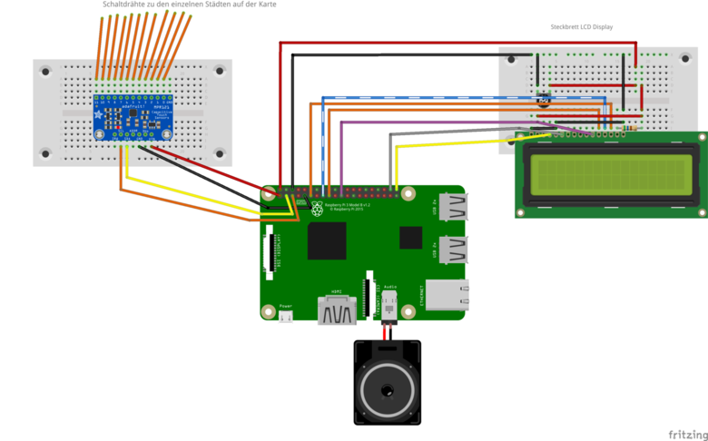

# Projektname: Travel the world        

## Kurzbeschreibung:
Interaktive Weltkarte: Durch Anfassen einer Stadt auf der Karten wird der Ortsnamen und Ortszeit auf einem Display angezeigt. Daneben wir die passende Nationalhymne als Musik über einen PC-Lautsprecher ausgegeben. Der Lautsprecher wird am Audio-Anschluss des Raspberry Pi eingesteckt.

<br/>
Foto: Prof. Dr. Angelika Beranek


## Zielgruppe

Für die Umsetzung: Pfadfinder*innen // Ranger/Rover
"Lernen der Welt" ist auch schon für einen jüngerere Zielgruppe geeignet.

## Materialbedarf
+ MDF-Platte
+ Raspberry Pi
+ 2 Steckbretter
+ [Adafruit MPR121](https://learn.adafruit.com/mpr121-capacitive-touch-sensor-on-raspberry-pi-and-beaglebone-black) (Kapazitiver Sensor der 12 Kontakten verarbeiten kann) - Anleitung vom Hersteller: [Adafruit](https://learn.adafruit.com/mpr121-capacitive-touch-sensor-on-raspberry-pi-and-beaglebone-black)
+ LCD-Display
+ Widerstand 560 Ohm (für das LCD-Display)
+ Potentiometer 15 kOhm (für die Steuerung vom Kontrast des LCD-Display)
+ Kabel
+ Rolle selbstklebende Kupferfolie
+ Rolle Schaltdraht (Querschnitt 0.2 mm&sup2;)

## Aufbau

[](images/travel_the_world_Steckplatine.png)

## Arbeitsschritte
1. Herunterladen einer Weltkarte als Vektordatei.
2. Vektordatei von Information befreien, die die Fräse nicht auflösen kann.
3. Fräsen der MDF-Platte mit den Kartendaten
4. aus selbstklebender Kupferfolie werden Kreise für die Städte ausgeschnitten. Die Punkte werden entsprechend der Städte auf der Karte aufgeklebt.
5. neben jeder Stadt wird mit einem Akku-Bohrer ein kleines Loch gebohrt.
6. Durch das Loch wir der Schaltdraht eingefädelt.
7. Damit der Draht auch bei jeder Stadt gut hält, wird der Draht durch einen kleinen Lötpunkt fixiert.
8. Schaltdrähte beschriften und auf der Rückseite der Karte mit Klebeband fixieren.
9. Einstecken der Städte in die Kontakte (1-12) am Kapazitiven Sensor.
10. herunterladen der Nationalhymnen aus dem Internet. Das Programm kann nur mit WAV-Dateien umgehen. Eventuell muss die Datei mit z.B. Audacity konvertiert werden.
11. die Nationalhymnen in einem Ordner auf dem Raspberry Pi hochladen.
12. Programm starten und Funktion testen.
13. Treiber für das LCD-Display installieren([https://github.com/adafruit/Adafruit_Python_CharLCD](https://github.com/adafruit/Adafruit_Python_CharLCD)).

Adafruit liefert mehrere Programmbeispiele mit. Das Programm das am Besten zu unsrem Vorhaben gepasst hat, haben wir angepasst.

## Quell-Code
```python
# Copyright (c) 2014 Adafruit Industries
# Author: Tony DiCola
#
# Permission is hereby granted, free of charge, to any person obtaining a copy
# of this software and associated documentation files (the "Software"), to deal
# in the Software without restriction, including without limitation the rights
# to use, copy, modify, merge, publish, distribute, sublicense, and/or sell
# copies of the Software, and to permit persons to whom the Software is
# furnished to do so, subject to the following conditions:
#
# The above copyright notice and this permission notice shall be included in
# all copies or substantial portions of the Software.
#
# THE SOFTWARE IS PROVIDED "AS IS", WITHOUT WARRANTY OF ANY KIND, EXPRESS OR
# IMPLIED, INCLUDING BUT NOT LIMITED TO THE WARRANTIES OF MERCHANTABILITY,
# FITNESS FOR A PARTICULAR PURPOSE AND NONINFRINGEMENT. IN NO EVENT SHALL THE
# AUTHORS OR COPYRIGHT HOLDERS BE LIABLE FOR ANY CLAIM, DAMAGES OR OTHER
# LIABILITY, WHETHER IN AN ACTION OF CONTRACT, TORT OR OTHERWISE, ARISING FROM,
# OUT OF OR IN CONNECTION WITH THE SOFTWARE OR THE USE OR OTHER DEALINGS IN
# THE SOFTWARE.
import sys
import time
import pygame
import Adafruit_CharLCD as LCD
import time, subprocess, datetime

lcd_rs = 21
lcd_en = 20
lcd_d4 = 25
lcd_d5 = 24
lcd_d6 = 23
lcd_d7 = 18
lcd_backlight = 4

lcd_columns = 16
lcd_rows = 2

today = datetime.date.today()
scoutlab = datetime.date(2017, 10, 20) #angebrochenen Tag ausgleichen
diff = scoutlab - today
z1 = time.strftime("%H:%M")


# Initialize the LCD using the pins above.
lcd = LCD.Adafruit_CharLCD(lcd_rs, lcd_en, lcd_d4, lcd_d5, lcd_d6, lcd_d7,
lcd_columns, lcd_rows, lcd_backlight)


import Adafruit_MPR121.MPR121 as MPR121

# Thanks to Scott Garner & BeetBox!
# https://github.com/scottgarner/BeetBox/

print 'Travel the World - Scoutlab 2017'
lcd.clear()
lcd.set_cursor(0, 1)
lcd.message('%s' % z1)
# Create MPR121 instance.
cap = MPR121.MPR121()

# Initialize communication with MPR121 using default I2C bus of device, and
# default I2C address (0x5A).  On BeagleBone Black will default to I2C bus 0.
if not cap.begin():
    print('Error initializing MPR121.  Check your wiring!')
    sys.exit(1)

# Alternatively, specify a custom I2C address such as 0x5B (ADDR tied to 3.3V),
# 0x5C (ADDR tied to SDA), or 0x5D (ADDR tied to SCL).
#cap.begin(address=0x5B)

# Also you can specify an optional I2C bus with the bus keyword parameter.
#cap.begin(busnum=1)

pygame.mixer.pre_init(44100, -16, 12, 512)
pygame.init()

# Define mapping of capacitive touch pin presses to sound files
# tons more sounds are available but because they have changed to .flac in /opt/sonic-pi/etc/samples/ some will not work
# more .wav files are found in /usr/share/scratch/Media/Sounds/ that work fine this example uses Aniamal sounds.

# SOUND_MAPPING = {
#  0: '//',
#  1: '/opt/sonic-pi/etc/samples/elec_hollow_kick.flac',
#  2: '/opt/sonic-pi/etc/samples/ambi_soft_buzz.flac',
#  3: '/opt/sonic-pi/etc/samples/bass_dnb_f.flac',
#  4: '/opt/sonic-pi/etc/samples/bass_hit_c.flac',
#  5: '/opt/sonic-pi/etc/samples/elec_plip.flac',
#  6: '/opt/sonic-pi/etc/samples/bass_trance_c.flac',
#  7: '/opt/sonic-pi/etc/samples/vinyl_backspin.flac',
#  8: '/opt/sonic-pi/etc/samples/elec_soft_kick.flac',
#  9: '/opt/sonic-pi/etc/samples/elec_tick.flac',
#  10: '/opt/sonic-pi/etc/samples/vinyl_rewind.flac',
#  11: '/opt/sonic-pi/etc/samples/elec_twang.flac',
# }

#UNCOMMENT FOR ANIMAL SOUNDS :)

SOUND_MAPPING = {
   0: '/home/pi/Scoutlab/usa.wav',
   1: '/home/pi/Scoutlab/australien.wav',
   2: '/home/pi/Scoutlab/barsilien.wav',
   3: '/home/pi/Scoutlab/groenland.wav',
   4: '/home/pi/Scoutlab/indien.wav',
   5: '/home/pi/Scoutlab/mexiko.wav',
   6: '/home/pi/Scoutlab/russland.wav',
   7: '/home/pi/Scoutlab/senegal.wav',
   8: '/home/pi/Scoutlab/suedafrika.wav',
   9: '/home/pi/Scoutlab/thailand.wav',
   10: '/home/pi/Scoutlab/usa.wav',
   11: '/home/pi/Scoutlab/deutschland.wav',
 }

sounds = [0,0,0,0,0,0,0,0,0,0,0,0]


for key,soundfile in SOUND_MAPPING.iteritems():
        sounds[key] =  pygame.mixer.Sound(soundfile)
        sounds[key].set_volume(1);

# Main loop to print a message every time a pin is touched.
print('Press Ctrl-C to quit.')
last_touched = cap.touched()
while True:
    current_touched = cap.touched()
    # Check each pin's last and current state to see if it was pressed or released.
    for i in range(12):
        # Each pin is represented by a bit in the touched value.  A value of 1
        # means the pin is being touched, and 0 means it is not being touched.
        pin_bit = 1 << i
        # First check if transitioned from not touched to touched.
        if current_touched & pin_bit and not last_touched & pin_bit:
           if i == 0:
	     stadt = 'Washington DC   '
             lcd.set_cursor(0, 0)
             lcd.message('%s' % stadt)
	   if i == 1:
	     stadt = 'Canberra      '
             lcd.set_cursor(0, 0)
             lcd.message('%s' % stadt)
	   if i == 2:
	     stadt = 'Brasilia     '
             lcd.set_cursor(0, 0)
             lcd.message('%s' % stadt)
	   if i == 3:
	     stadt = 'Nuuk        '
             lcd.set_cursor(0, 0)
             lcd.message('%s' % stadt)
	   if i == 4:
	     stadt = 'Neu Delhi    '
	     lcd.set_cursor(0, 0)
             lcd.message('%s' % stadt)
	   if i == 5:
	     stadt = 'Mexiko City   '
             lcd.set_cursor(0, 0)
             lcd.message('%s' % stadt)
	   if i == 6:
	     stadt = 'Moskau      '
             lcd.set_cursor(0, 0)
             lcd.message('%s' % stadt)
	   if i == 7:
	     stadt = 'Dakar'
	     lcd.set_cursor(0, 0)
             lcd.message('%s' % stadt)
	   if i == 8:
	     stadt = 'Kapstadt   '
             lcd.set_cursor(0, 0)
             lcd.message('%s' % stadt)
	   if i == 9:
	     stadt = 'Bangkok       '
	     lcd.set_cursor(0, 0)
             lcd.message('%s' % stadt)
	   if i == 10:
	     stadt = 'Juneau     '
	     lcd.set_cursor(0, 0)
             lcd.message('%s' % stadt)
	   if i == 11:
	     stadt = 'Berlin     '
             lcd.set_cursor(0, 0)
             lcd.message('%s' % stadt)
 	   if (sounds[i]):
              sounds[i].play()
        # if not current_touched & pin_bit and last_touched & pin_bit:
             # stadt = '                '
             # lcd.set_cursor(0, 0)
             # lcd.message('%s' % stadt)

    # Update last state and wait a short period before repeating.
    last_touched = current_touched


    # Alternatively, if you only care about checking one or a few pins you can
    # call the is_touched method with a pin number to directly check that pin.
    # This will be a little slower than the above code for checking a lot of pins.
    #if cap.is_touched(0):
    #    print('Pin 0 is being touched!')

    # If you're curious or want to see debug info for each pin, uncomment the
    # following lines:
    #print('\t\t\t\t\t\t\t\t\t\t\t\t\t 0x{0:0X}'.format(cap.touched()))
    #filtered = [cap.filtered_data(i) for i in range(12)]
    #print('Filt:', '\t'.join(map(str, filtered)))
    #base = [cap.baseline_data(i) for i in range(12)]
    #print('Base:', '\t'.join(map(str, base)))
```
**Download Quelltext:** [travel_the_world.py](code/travel_the_world.py)

## ToDo
+ ~~Eingabe der Zeitzone im Verhältnis zur aktuellen Uhrzeit für jede Stadt~~ umgesetzt am 01.11.2017
+ ~~Berechnung und Ausgabe der Uhrzeit~~ umgesetzt am 01.11.2017
+ optimieren des Quell-Code

### Berechnung und Ausgabe der Uhrzeit (Python-Funktion für die Berechnung der Ortszeit)
Die Berechnung erfolgt in der UTC-Zeit.
```python
#!/usr/bin/env python
import datetime
from datetime import timedelta

def weltuhr(x):
 global ortszeit
 ortszeit = datetime.datetime.utcnow() + timedelta(hours = x)

while True:
  # Ortszeit liegt -5 h hinter der UTC-Zeit  
 weltuhr(-5)
 print  ortszeit.strftime("%H:%M Uhr")
```

**Download Quelltext mit Berechnung der Ortszeit:** [20171101travel_the_world.py](code/20171101travel_the_world.py)

## Credits
Dank an den [Erfindergarden](https://www.erfindergarden.de) für das Fräsen der Karte.
