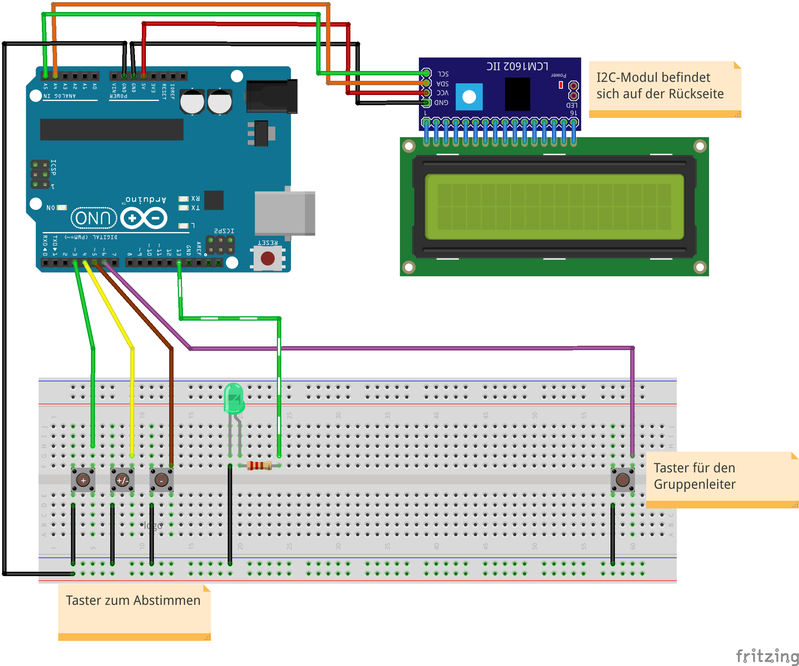

# Projektname: Stimmungsboard

## Kurzbeschreibung:
Mit dem Stimmungsboard können nach Gruppenstunden diese durch die Teilnehmer*innen bewertet werden.
Über den extra Taster kann die*der Gruppenleiter*in den Durchschnitt aller Bewertungen abrufen und über das Display ausgeben lassen. Damit werden auch alle gespeicherten Ergebnisse zurückgesetzt. Über die Schnittstelle (API) ist es möglich die Daten per Python-Script in einer SQL-Datenbank zur speichern.
Auf einer Webseite können die Bewertungen nach Datum selektiert werden, danach wird das Ergebnis in Form einer Tortengrafik dargestellt.

## Zielgruppe

Für die Umsetzung: Pfadfinder\*innen // Ranger\*Rover

## Materialbedarf
+ Arduino Uno
+ LCD-Display mit I2C-Modul
+ Steckbrett
+ Kabel
+ LED grün
+ 220 Ohm Widerstand

## Aufbau

## Code
[Arduino-Code](code/Arduino_Code.ino)

## Aufsetzen Webseite und SQL-Datenbank
- [SQL-Dump](appendix/SQL_Dump/stimmungsboard.sql)
- [Python-Programm und Schnittstelle](appendix/Python-Code/Programm.py)
- [Webseite](appendix/Website/Website.zip)

## 3-Druck Gehäuse
- [Gehäuse](appendix/3D-Modell/Box_unten.stl)
- [Deckel](appendix/3D-Modell/Deckel.stl)

## Team
Julius, PiDi, Spike
