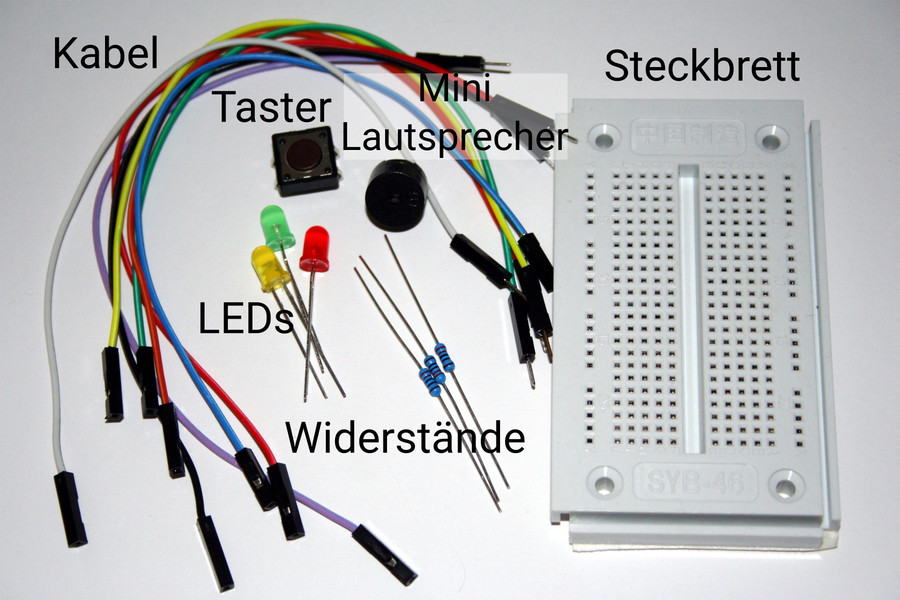

# Scoutlab-Session Kit 1

Der Raspberry Pi ist ein kleiner, günstiger Computer zum Basteln und Experimentieren.
Ein Computer besteht auch Hardware und Software. Die Hardware ist all das, was du anfassen kannst (z.B. der Raspberry Pi, der Monitor, die Maus). Die Software sind die Programme die auf dem Computer laufen und sein Verhalten steuern. Mit der Programmierung legst du das Verhalten deines Raspberry Pis fest. Hier kannst du kreativ sein. Ohne Programmierung kannst du mit einem Computer oder Raspberry Pi nicht viel anfangen.

* In **Scratch** brauchst du für das Programmieren keinen Programmcode einzugeben. Die benötigten Blöcke ziehst du einfach per Drag-and-drop an die passende Stelle. Du baust Computerprogramme mit der Maus aus Bausteinen auf dem Bildschirm zusammen.

* **Python** ist eine Programmiersprache für Profis und auch für große und spezielle Projekte verwendet wird. Mit Python entwickelst du Programme, die Daten von Sensoren oder Kamerabilder auswerten, Steuerungen für LEDs und vieles mehr.

## Raspberry Pi

Das Besondere beim Raspberry Pi gegenüber einem normalen Computer ist, dass du die Hardware verändern und erweitern kannst. Im Prinzip baust du bei jedem Projekt deinen eigenen Computer aus Einzelteilen zusammen.

* Das sind Geräte wie Monitor, Maus und Tastatur, die du wahrscheinlich schon zu Hause hast und die du auch für andere Zwecke verwenden kannst.

* Kleine elektronische Schaltungen, die du auf einem Steckbrett aus Bauteilen aus deinem Scoutlab Session Kit (z.B. Leuchtdioden, Taster, Widerstände) zusammensetzt.

### Aufbau

**General Purpose Input Output Device — oder kurz GPIO**
Bedeutet "Ein- Ausgabegerät für viele Verwendungszwecke". Das sind die 40 Pins, die aus der Platine herausragen.
Die Pins sind in der Zeichnung mit einem blauen Rand versehen. Hier kannst du mit den Kabeln aus dem Scoutlab Session Kit die Schaltungen aus den Arbeitsblättern anschließen.

**USB-Buchsen**.
Hier schließt du die Tastatur und die Maus an.

**Power**
An der kleinen USB-Buchse schließt du das Netzteil an.

**HDMI-Buchse**
Hier schließt du das HDMI-Kabel für den Monitor an.

### Das ist gerade alles zu kompliziert?
Dann hilft dir sicher unser [Schnelleinstieg: Raspberry Pi einrichten](https://vcp-scoutlab.github.io/scoutlab-session-kit-1/einrichtung-raspberrypi) weiter.

## Link-Tipp
Einen umfassenden Leitfaden zur Raspberry Pi Anschlussbelegung: [https://de.pinout.xyz/](https://de.pinout.xyz/)

<h2>Vorsicht</h2>
Unter keinen Umständen irgendwelche GPIO-Pins mit einander verbinden!
Nicht alle GPIO-Pins lassen sich programmieren, einige sind fest vergeben oder führen Spannung.
Ein Kurzschluss von den Pins kann deinen Raspberry Pi komplett zerstören!
Bei LEDs und z.B. Schaltern muss immer ein Schutzwiderstand vorgeschaltet werden.
Bitte halte dich an die Schaltpläne aus den einzelnen Anleitungen.

## Inhalt Scoutlab Session Kit 1 – Übersicht

