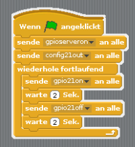

## Downloads zum Scoutlab Session Kit 1

Die verwendeten Programme findest du auf der <a href="https://vcp-scoutlab.github.io/scoutlab-session-kit-1/download"><strong>Download-Seite</strong></a> zum Download.
Entpacke die Dateien aus dem ZIP-Archiv in das Verzeichnis /home/pi auf deinem Raspberry Pi.
Die Scratch-Beispiele findest du im Verzeichnis scratch.
Die Python-Beispiele findest du dann im Verzeichnis python.

<h3>Tipp für Lager & Gruppenstunden</h3>
Nimm das Steckbrett aus der Tüte und leere nun die ganzen Bauteile in ein sauberes und trockenes Berghaferl.
Damit fallen dir keine Bauteile vom Tisch oder gehen auf dem Lager verloren.

## Scratch verwenden
Starte das Scratch-Programm, indem Du auf Menü klickst, gefolgt von Entwicklung und dann Scratch auswählen

<iframe src="https://player.vimeo.com/video/217228128?h=8cafa31af9&amp;badge=0&amp;autopause=0&amp;player_id=0&amp;app_id=58479" frameborder="0" allow="autoplay; fullscreen; picture-in-picture" allowfullscreen style="position:absolute;top:0;left:0;width:100%;height:100%;" title="start_scratch"></iframe>

### Starten eines Scratch-Programms

Sobald du dein Programm geöffnet hast, musst du auf die grüne Fahne klicken, um das Programm zu starten.

<iframe src="https://player.vimeo.com/video/217362376" width="640" height="360" frameborder="0" webkitallowfullscreen mozallowfullscreen allowfullscreen></iframe>

