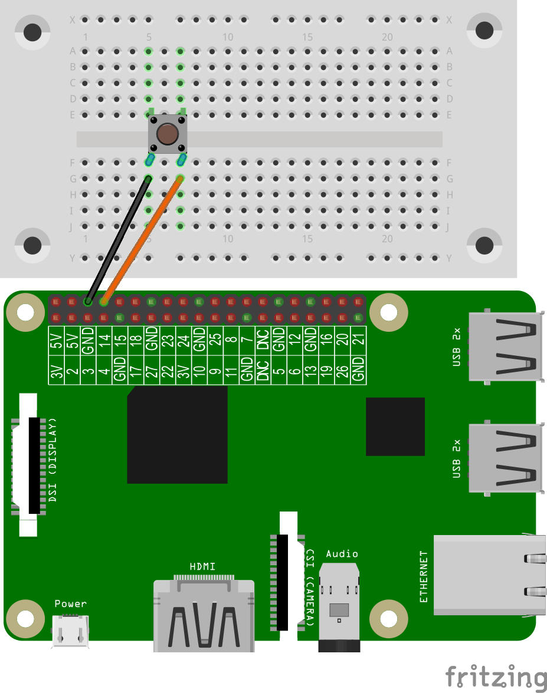
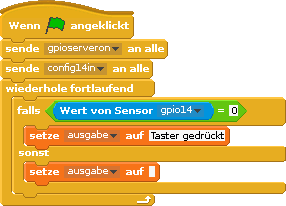

# Taster auslesen

## Material
* Taster
* 2 Kabel
* Steckbrett


Stecke den Taster auf das Steckbrett. Achte unbedingt darauf, dass der Taster exakt wie abgebildet eingesteckt
wird.
<div style="page-break-after: always;"></div>
## Aufbau


## Taster
Ein Taster schließt einen Stromkreis erst, wenn der Taster gedrückt wird. Der Taster ist ein Eingabegerät

>**Scratch**: `taster.sb` in deinem Projekt-Ordner für Scratch.
>
>**Python**: `taster.py` in deinem Projekt-Ordner für Python.

## Scratch-Programm



Hier benötigen wir den GPIO-Pin 14 für den Taster als Eingabe.
In der Schleife wird geprüft, ob der Taster
(**Wert von Sensor gpio14=0**) gedrückt wird. Wenn der Taster betätigt wird, bekommt die eigene Variable **ausgabe** den Wert „Taster gedrückt“. Das Ergebnis wird auf dem Bildschirm angezeigt.

### Variablen
<div class="alert alert-info" role="alert">Variablen können wir uns als kleine Boxen oder Container vorstellen, in denen wir Informationen speichern können. Wenn das Programm beendet wird, werden diese Variablen automatisch wieder geleert. Variablen 	müssen in Scratch erst einmal angelegt werden, bevor man die Variablen benutzen kann.</div>


## Python-Programm

```python
import RPi.GPIO as GPIO
GPIO.setmode(GPIO.BCM)
GPIO.setwarnings(False)
from time import sleep

TasterPin = 14
GPIO.setup(TasterPin, GPIO.IN)

while True:
    if GPIO.input(TasterPin) == False:
    	print('Taster gedrueckt')
        sleep(0.2)
```
Der Taster ist zwischen GPIO-Pin 14 und GND-Pin angeschlossen. Durch Drücken des Tasters wird der Stromkreis geschlossen. Wird der Taster wieder losgelassen, wird der Stromkreis unterbrochen. Wenn der Stromkreis unterbrochen ist dann  hat das den Zustand ‘False’.

Für jeden verwendeten GPIO-Pin musst du mitteilen, wie du den GPIO-Pin im Skript nutzen möchtest. Dazu gibst du mit setup an, ob du den GPIO-Pin zur Ein- oder zur Ausgabe verwenden möchtest. In diesem Beispiel nutzen wir einen Taster als Eingabe: GPIO.setup(TasterPin, GPIO.IN)
if-Verzweigungen

Die Umsetzung ist relativ leicht verständlich:
```python
if GPIO.input(TasterPin) == False:
    	print('Taster gedrueckt')
```
Python durchläuft das Skript bis zur ersten passenden Bedingung.
