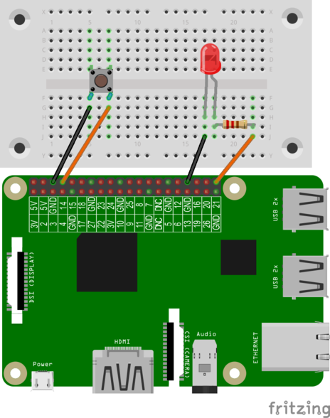

# LED mit einem Taster schalten

## Material
* 1x LED
* 1x 220 Ohm Widerstand
* 1x Taster
* 4x Kabel
* 1x Steckbrett


<div style="page-break-after: always;"></div>
## Aufbau

Wir erweitern die Schaltung aus dem Schritt "Taster auslesen" um eine LED und einen Schutzwiderstand.




>**Scratch**: `taster_led.sb` in deinem Projekt-Ordner für Scratch.
>
>**Python**: `taster_led.py` in deinem Projekt-Ordner für Python.

## Scratch-Programm


Am GPIO-Pin 21 ist die LED angeschlossen. Am GPIO-Pin 14 wir der Taster angeschlossen.
Eine Schleife prüft, ob der Taster (**Wert von Sensor gpio14=0**) gedrückt wird. Wenn die Bedingung erfüllt ist, leuchtet die LED.


## Python-Programm

```python
import RPi.GPIO as GPIO
GPIO.setmode(GPIO.BCM)
GPIO.setwarnings(False)
from time import sleep
TasterPin = 14
LED_Pin = 21
GPIO.setup(TasterPin, GPIO.IN, pull_up_down=GPIO.PUD_UP)
GPIO.setup(LED_Pin, GPIO.OUT)
while True:
    if GPIO.input(TasterPin) == False:
        GPIO.output(LED_Pin, GPIO.HIGH)
    else:
        GPIO.output(LED_Pin, GPIO.LOW)
sleep(0.2)
```

Die GPIO-Pins sind internen mit Pull-up- und Pull-down-Widerständen versehen. Das vereinfacht z. B. den Anschluss von Tastern. Wenn du den Pull-up-oder Pull-down-Widerstand an einem GPIO-Pin nutzen möchtest, dann musst im setup, wie im folgenden Beispiel, einen dritten Parameter mit angeben:

```python
GPIO.setup(TasterPin, GPIO.IN, pull_up_down=GPIO.PUD_UP)
```
der dritter Parameter lautet:  pull_up_down=GPIO.PUD_UP  - steht für der Taster ist beim Start des Script nicht gedrückt.
Der Taster ist immer eine Eingabe, daher GPIO.IN.
