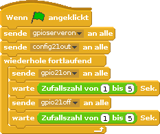

# LED mittels Zufallszahl steuern
## Material
* 1x LED
* 1x 220 Ohm Widerstand
* 2x Kabel
* 1x Steckbrett


<div style="page-break-after: always;"></div>
## Aufbau


>**Scratch**: `led_zufall.sb` in deinem Projekt-Ordner für Scratch.
>
>**Python**: `led_zufall.py` in deinem Projekt-Ordner für Python.

<div style="page-break-after: always;"></div>

## Scratch-Programm



Nun wollen wir das Arbeitsblatt „LED mit einem Programm schalten“ etwas interessanter gestalten. Unter Operatoren findest du in Scratch den passenden Block


In beiden Blöcken werden „warte 2 Sek.“ durch den neuen Block ersetzt. Ziehe einfach den Block in das Feld mit der „2“. Jetzt lässt das Programm die LED zufällig lang (zwischen 1 und 5 Sekunden) leuchten. Auch die Pause, während die LED nicht leuchtet, ist ebenfalls zufällig lang (zwischen 1 und 5 Sekunden).


## Python-Programm
```python
import RPi.GPIO as GPIO #Import der notwendigen Bibliotheken
GPIO.setmode(GPIO.BCM)
GPIO.setwarnings(False) #Warnungen abschalten
from time import sleep
from random import uniform #Import der Bibliothek für die Zufallszahlen
LED_Pin = 21 #LED ist am GPIO-Pin 21 angeschlossen
GPIO.setup(LED_Pin, GPIO.OUT) #Pin21 wird als Ausgabe definiert
while True: #Schleife (Wiederholung)
    GPIO.output(LED_Pin, GPIO.HIGH) #LED ein schalten
    sleep(uniform(1, 5)) #per Zufallszahl zwischen 1 und 5 sek warten
    GPIO.output(LED_Pin, GPIO.LOW) #LED aus schalten
    sleep(uniform(1, 5)) #per Zufallszahl zwischen 1 und 5 sek warten
    #nun wird die LED danach wieder eingeschaltet...
```
