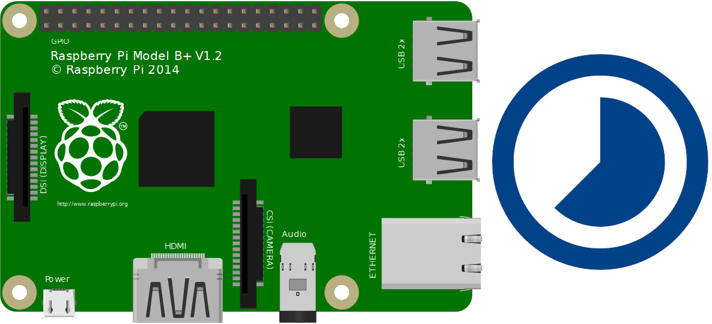
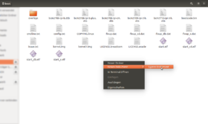
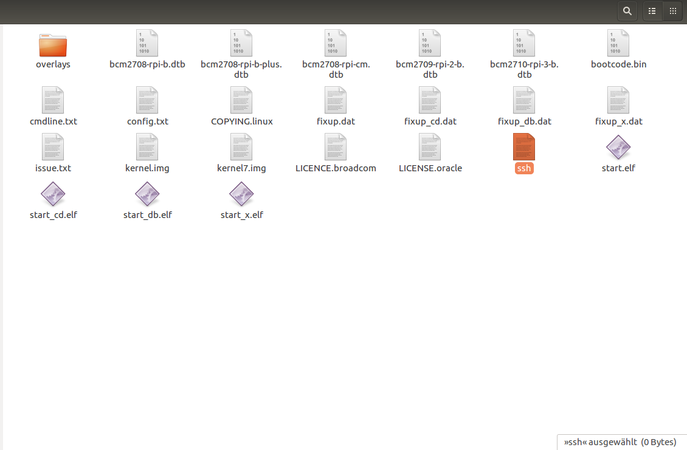
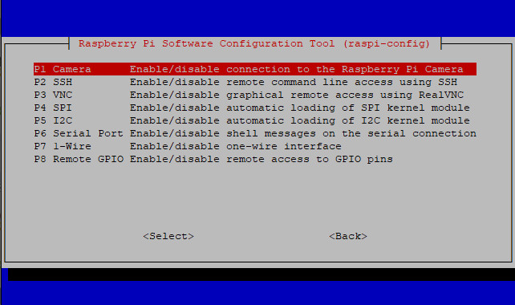
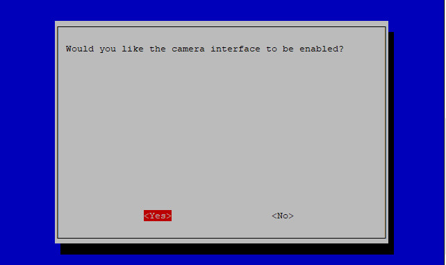
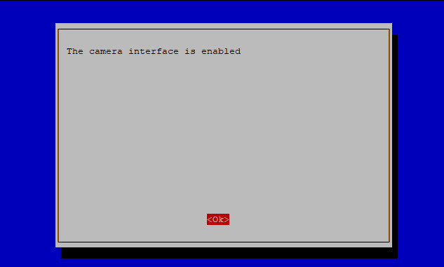

# Zeitraffer-Aufnahmen mit dem Raspberry Pi machen



Zeitraffer Aufnahmen (Timelapse) sehen eindrucksvoll aus – aber wie kann man sie möglichst einfach machen? Richtig! Mit dem Raspberry Pi. Alles was man dazu braucht ist ein Raspberry Pi, die Raspberry Pi Kamera, ein Batteriepack und eine Kaffeedose. Wie man den Raspberry Pi für solche Aufnahmen einsetzen kann, erklären wir in diesem Workshop.

## Material

+ Raspberry Pi – Modell A oder B (A hat eine bessere Akkulaufzeit)
+ Raspberry Pi Kameramodul installiert und eingerichtet
+ Illy Kaffeedose oder Behälter ähnlicher Größe. Wasserdicht und Metall ist am besten.
+ Etwas durchsichtiger Kunststoffklebeband, auf die äußere Dose über dem Loch geklebt
+ Kamerahalterung aus Kunststoff. Ich habe den Deckel aus dem Gehäuse dieser Batterien verwendet
+ Gummi-Bänder, um  und das Kabel des Kameramodul in Position zu halten
+ Batteriepack
<div style="page-break-after: always;"></div>
## Anleitung

### Raspberry Pi: SSH ohne Monitor & Tastatur aktivieren

Damit das Raspbian SSH aktiviert, schreibt man zunächst die Image-Datei wie üblich auf eine SD-Karte. Nach Abschluss der Aktion entnehmt ihr die Karte nicht sofort aus dem Kartenleser! Öffnet jetzt die /boot-Partition des Raspbian-Systems in einem Dateimanager und erstellt dort eine leere Datei mit dem Namen ssh.

Diese Anleitung funktioniert mit allen gängigen Betriebssystem, also mit Linux, MacOS X und auch mit dem Windows Explorer. Trennt jetzt wieder sicher den externen Datenträger (SD-Karte) vom Rechner.

Im nächsten Schritt steckt ihr die Karte, wie gewohnt, in euren Raspberry Pi. Nach dem Start ist der Raspberry Pi automatisch per ssh erreichbar. Damit kann ein neuer Raspberry Pi aufgesetzt werden, ohne dass man dafür Monitor, Tastatur und Maus benötigt.



neue leere Datei erstellen



die Datei ssh (wichtig: ohne Dateiendung)

Zunächst bringe dein System auf den aktuellen Stand:
```
sudo apt-get update
sudo apt-get upgrade
```

### Rechner-Name (Hostname)
+ time-lapse1
+ time-lapse2
+ time-lapse3
+ usw.

Wenn die Kamera installiert ist, können der Raspberry Pi und der Akku leicht aus der Dose gehoben werden, um Zugang zu den verschiedenen Anschlüssen zu erhalten. Ich finde, dass es beim Anschließen an ein Display und eine Tastatur leicht auf der Oberseite der Dose aufliegt, wenn Sie das Gerät mit einem Display verwenden müssen. SSH funktioniert ohne dass Sie es entfernen müssen, wenn eine Netzwerkverbindung verfügbar ist.
<div style="page-break-after: always;"></div>

### Aktivierung des Kameramoduls



raspi-config Kameramodul



raspi-config Kameramodul aktivieren Sicherheitsfrage



raspi-config Kameramodul aktiviert


Verbinde dich per ssh und übertrage die Datei "**_zeitraffer.py_**"

Einbinden der Datei per cron.

```
Rechte des Scripts müssen natürlich stimmen.

sudo chmod 777 /home/pi/time-lapse.sh

sudo su
nano /etc/crontab

@reboot   pi   /home/pi/time-lapse.sh > /dev/null 2>&1

sudo shutdown "now"
```

<div style="page-break-after: always;"></div>
### Einzelbilder zu einem Videoclip verwandeln
Du kannst auch die einzelnen Standbilder zu einem Videoclip kombinieren. Das geht lokal mit einer Videoschnitt-Programm. Wenn man das auf dem Raspberry machen möchte dazu ist folgender Code notwendig:

```
cd /<your_timelapse_folder>
ls *.jpg > list.txt
sudo apt-get install mencoder
mencoder -nosound -ovc lavc -lavcopts vcodec=mpeg4:aspect=16/9:vbitrate=8000000 -vf scale=1920:1080 -o timelapse.avi -mf type=jpeg:fps=24 mf://@list.txt

```

<div class="hidden-print">
<iframe width="560" height="315" src="https://www.youtube.com/embed/QSzAqc_NVhE?rel=0" title="YouTube video player" frameborder="0" allow="accelerometer; autoplay; clipboard-write; encrypted-media; gyroscope; picture-in-picture" allowfullscreen></iframe>
</div>
<div class="hidden-print">
<iframe width="560" height="315" src="https://www.youtube.com/embed/clfsVJbftlY?rel=0" title="YouTube video player" frameborder="0" allow="accelerometer; autoplay; clipboard-write; encrypted-media; gyroscope; picture-in-picture" allowfullscreen></iframe>
</div>
